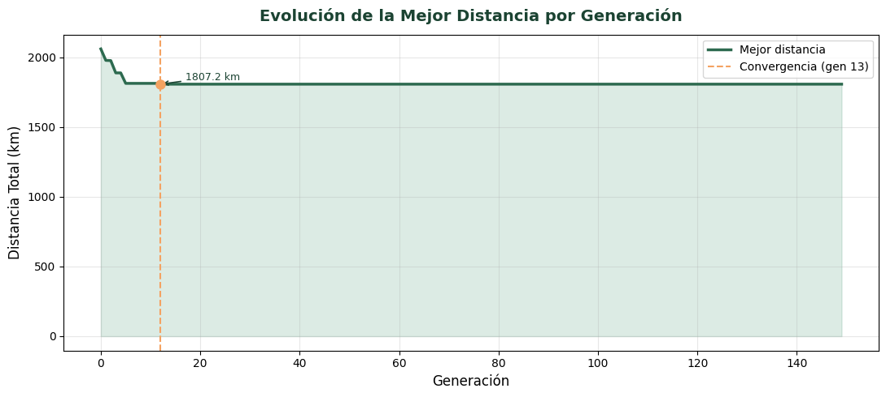
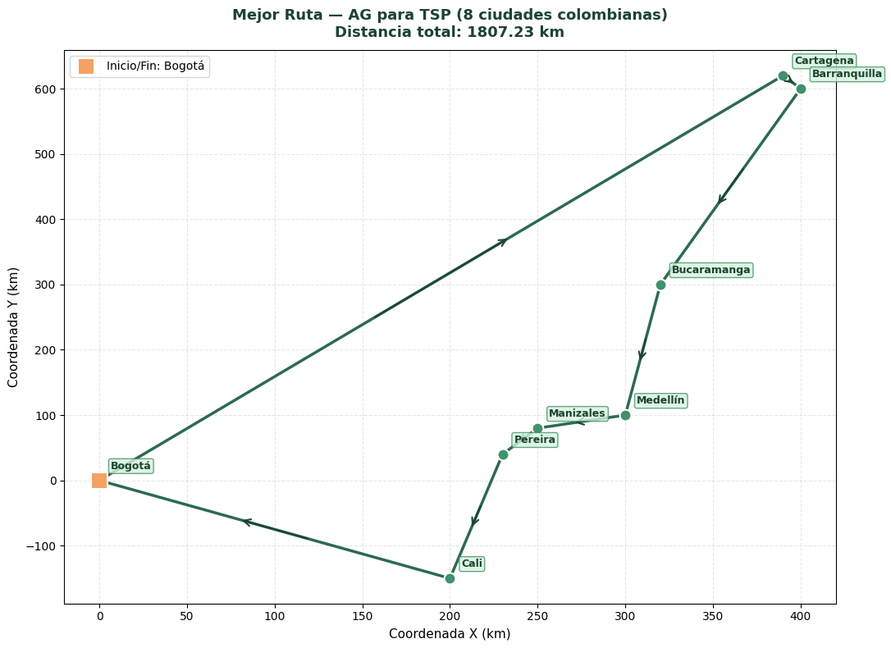

# 🧬 Genetic Algorithm for Traveling Salesman Problem (TSP)


---

## 🚀 Overview

This project presents the implementation of a **Genetic Algorithm (GA)** to solve the **Traveling Salesman Problem (TSP)**, a well-known combinatorial optimization problem.

Using a dataset of major Colombian cities, the algorithm searches for the **optimal route that minimizes total travel distance**, ensuring each city is visited exactly once before returning to the origin.

The solution demonstrates the application of **evolutionary computation techniques** for solving complex optimization problems in a data-driven context.

---

## 🧠 Key Features

* ✔ Genetic Algorithm implemented from scratch
* ✔ Fitness evaluation based on total route distance
* ✔ Population-based optimization approach
* ✔ Evolution across generations with convergence tracking
* ✔ Visualization of optimization process and final solution

---

## 🧰 Tech Stack

* **Language:** Python
* **Libraries:** NumPy, Matplotlib
* **Core Concepts:** Genetic Algorithms, Optimization, Heuristics, TSP

---

## 📁 Project Structure

```
genetic-algorithm-tsp/
│
├── notebooks/
│   └── tsp_genetic_algorithm.ipynb
├── images/
│   ├── evolution.png
│   └── ruta_optima.png
├── README.md
```

---

## ⚙️ Installation

Clone the repository:

```bash
git clone https://github.com/pipediaz1234/genetic-algorithm-tsp.git
cd genetic-algorithm-tsp
```

Install dependencies:

```bash
pip install numpy matplotlib
```

---

## ▶️ Usage

Run the Jupyter Notebook:

```bash
jupyter notebook
```

Open the main notebook:

```
notebooks/tsp_genetic_algorithm.ipynb
```

---

## 🔍 Methodology

The implemented Genetic Algorithm follows a standard evolutionary pipeline:

1. **Initialization:** Generate a random population of candidate routes
2. **Fitness Evaluation:** Compute total distance for each route
3. **Selection:** Retain the best-performing individuals
4. **Crossover:** Recombine routes to produce new offspring
5. **Mutation:** Introduce randomness to maintain diversity
6. **Iteration:** Repeat the process until convergence criteria are met

---

## 📊 Results & Visualizations

### 🔹 Evolution of Best Distance per Generation



📌 The algorithm achieves convergence around **generation 13**, reaching a minimum distance of:

**1807.23 km**

---

### 🔹 Optimal Route (Colombian Cities)



📍 The optimized route includes:

* Bogotá (Start/End)
* Cali
* Pereira
* Manizales
* Medellín
* Bucaramanga
* Barranquilla
* Cartagena

---

## 📈 Performance Analysis

* Rapid convergence observed in early generations
* Stability achieved after generation 13
* Effective reduction in total route distance through evolutionary optimization
* Demonstrates the efficiency of heuristic methods for NP-hard problems like TSP

---

## 💡 Future Improvements

* 🔹 Hyperparameter tuning (population size, mutation rate)
* 🔹 Advanced crossover strategies (PMX, OX)
* 🔹 Hybrid approaches (Genetic Algorithm + Local Search)
* 🔹 Real-time or interactive visualizations

---

## 👨‍💻 Author

**Andrés Felipe Díaz Campos**
Systems Engineering & Computer Science Student
Data Analyst | AI Enthusiast

🔗 LinkedIn:
https://www.linkedin.com/in/andres-felipe-diaz-campos-398245207/

---

## 📄 License

This project is developed for academic and professional portfolio purposes.
